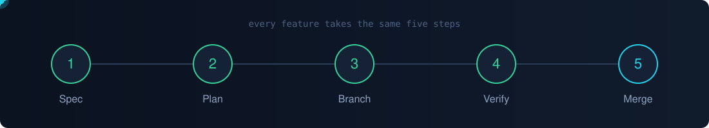
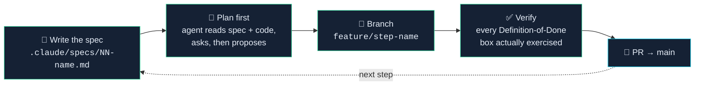
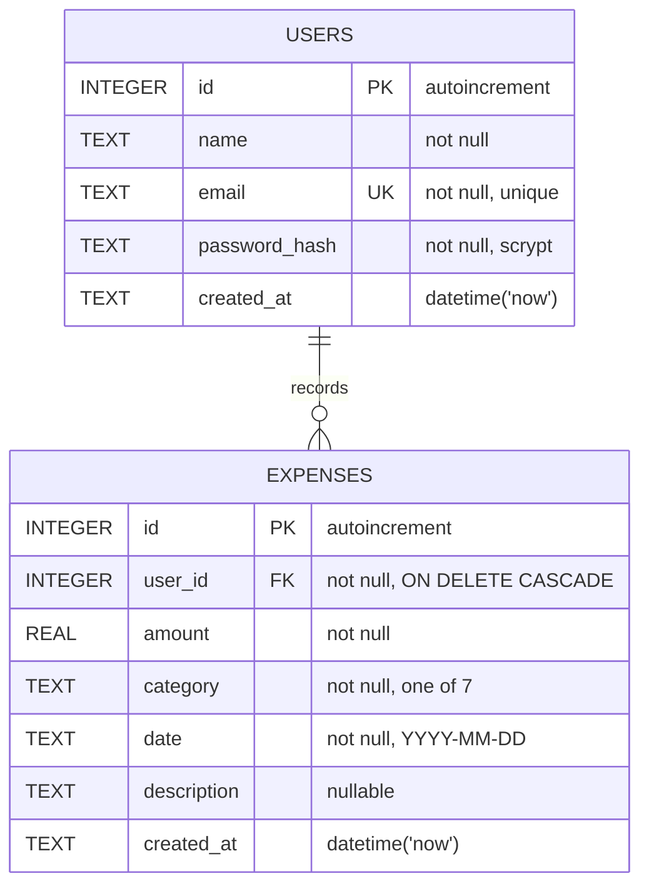

<div align="center">



<br>


**A personal expense tracker built with Flask and SQLite — and an excuse to learn Claude Code properly.**

</div>

---

## 🎯 Why this project exists

> I'm building Spendly to **learn [Claude Code](https://claude.com/claude-code)**.
>
> The expense tracker is the vehicle. The actual goal is getting fluent with the tool — writing
> specs an agent can execute, planning before coding, *reviewing* what the agent produces instead
> of accepting it, and keeping the whole thing in a git workflow that doesn't fall apart.
>
> So the interesting part of this repo isn't the app. It's **`.claude/specs/`** and the commit
> history: every feature starts as a written spec, becomes an approved plan, gets implemented on
> its own branch, and lands through a pull request.

<div align="center">

</div>

---

## 🔁 The loop I'm practising

<div align="center">

</div>



<details>
<summary><b>💥 The mistake that taught me the loop matters — click to read</b></summary>

<br>

On Step 1 I let the agent write `database/db.py` **before** reading the spec. It produced a
perfectly reasonable data layer:

- a normalised `categories` table with a foreign key
- a category list of its own invention
- a `spent_on` date column
- its own choice of demo user

Every one of those contradicted the spec, which wanted a flat `category TEXT` column, a fixed
7-value list, a `date` column, and a specific demo account. All of it had to be thrown out and
rewritten.

**Lesson: spec first, then plan, then code.** A fast wrong answer costs more than a slow right
one. This is the habit the project is really teaching, and it's why plan mode now comes before
every step.

</details>

---

## ⚡ Quick start

<details open>
<summary><b>Setup — three commands</b></summary>

<br>

```bash
git clone https://github.com/Mohit-Kumar-Thakur/Spendly.git
cd Spendly

python -m venv venv
source venv/bin/activate        # Windows: venv\Scripts\activate

pip install -r requirements.txt
python app.py
```

Open **http://127.0.0.1:5001** 🎉

The database is created and seeded automatically on startup — no migration step, no setup script.

</details>

<details>
<summary><b>🔑 Demo account</b></summary>

<br>

| | |
| --- | --- |
| **Email** | `demo@spendly.com` |
| **Password** | `demo123` |

Seeded with 8 sample expenses covering every category. Login itself arrives in Step 2 — until
then the account just sits in the database waiting.

</details>

<details>
<summary><b>🔄 Rebuilding the database from scratch</b></summary>

<br>

```bash
rm expense_tracker.db
python -m database.db
```

`init_db()` uses `CREATE TABLE IF NOT EXISTS` and `seed_db()` bails out early if any user exists,
so both are safe to run as many times as you like — you cannot duplicate the seed data.

</details>

---

## 🗄️ The data model



<details>
<summary><b>📋 Full column reference</b></summary>

<br>

**`users`**

| Column | Type | Constraints |
| --- | --- | --- |
| `id` | INTEGER | Primary key, autoincrement |
| `name` | TEXT | Not null |
| `email` | TEXT | Not null, **unique** |
| `password_hash` | TEXT | Not null |
| `created_at` | TEXT | Defaults to `datetime('now')` |

**`expenses`**

| Column | Type | Constraints |
| --- | --- | --- |
| `id` | INTEGER | Primary key, autoincrement |
| `user_id` | INTEGER | Not null, FK → `users.id`, `ON DELETE CASCADE` |
| `amount` | REAL | Not null |
| `category` | TEXT | Not null |
| `date` | TEXT | Not null, `YYYY-MM-DD` |
| `description` | TEXT | Nullable |
| `created_at` | TEXT | Defaults to `datetime('now')` |

</details>

<details>
<summary><b>🏷️ The seven categories</b></summary>

<br>

Fixed list, defined once as `CATEGORIES` in `database/db.py`:

`Food` · `Transport` · `Bills` · `Health` · `Entertainment` · `Shopping` · `Other`

They live in Python rather than a database table on purpose — the spec called for a flat
`category TEXT` column, and a lookup table would be over-engineering for seven values that
never change.

</details>

<details>
<summary><b>🔒 Rules the data layer sticks to</b></summary>

<br>

- **Parameterized queries only.** Never string formatting in SQL — not once, anywhere.
- **`PRAGMA foreign_keys = ON` on every connection.** SQLite has FK enforcement *off* by
  default, so without this a bad `user_id` inserts silently instead of failing.
- **`row_factory = sqlite3.Row`**, so rows are read by column name, not index.
- **`seed_db()` is idempotent** — returns early if any user exists.
- **Passwords hashed with `generate_password_hash`**, never stored in plain text.
- **No ORM.** Raw `sqlite3` so nothing hides what the queries are actually doing.

</details>

---

## 🛠️ Tech stack

<div align="center">

| Layer | Choice | Why |
| :--- | :--- | :--- |
| **Backend** | Flask 3.1 | Small enough to hold in your head |
| **Database** | SQLite via `sqlite3` | Standard library, zero setup, real SQL |
| **Templating** | Jinja2 | Comes with Flask |
| **Frontend** | Plain HTML + CSS + vanilla JS | No build step, nothing hidden |
| **Passwords** | `werkzeug.security` | Already a Flask dependency |
| **Tests** | pytest + pytest-flask | — |

</div>

No SQLAlchemy. No frontend framework. No bundler. Everything hand-written so there's nothing
between me and what's actually happening.

---

## 📁 Project structure

```
Spendly/
├── app.py                      # Flask app, routes, startup DB init
├── database/
│   ├── __init__.py
│   └── db.py                   # get_db() · init_db() · seed_db() · CATEGORIES
├── templates/                  # base · landing · login · register · terms · privacy
├── static/
│   ├── css/                    # style.css · landing.css
│   └── js/main.js
├── .claude/
│   └── specs/                  # 📌 one spec per step — the source of truth
├── .github/assets/             # the animated art in this README
├── requirements.txt
└── expense_tracker.db          # created on first run (gitignored)
```

---

## 🗺️ Roadmap

<div align="center">

| Step | Feature | Status |
| :---: | :--- | :---: |
| **1** | Database setup — schema, connection helper, seed data | ✅ **Done** |
| **2** | Registration | ✅ **Done** |
| **3** | Login / logout | ✅ **Done** |
| **4** | Profile page | ⬜ Next |
| **5** | Dashboard | ⬜ |
| **6** | Expense list | ⬜ |
| **7** | Add expense | ⬜ |
| **8** | Edit expense | ⬜ |
| **9** | Delete expense | ⬜ |

</div>

Routes for the unbuilt steps already exist in `app.py` as placeholders, so the shape of the
finished app is visible from commit one.

<details>
<summary><b>✅ Step 1 — what "done" actually meant</b></summary>

<br>

Every box below was exercised, not assumed:

- [x] Database file is created on app startup
- [x] Both tables exist with the exact columns and constraints from the spec
- [x] Demo user exists with a scrypt-hashed password (verified it isn't plain text)
- [x] 8 sample expenses spanning all 7 categories
- [x] Seeded three times in a row — counts stayed at 1 user / 8 expenses
- [x] Duplicate email raises `IntegrityError` (UNIQUE)
- [x] `user_id = 999` raises `IntegrityError` (foreign keys genuinely enforced)
- [x] Deleted the DB, ran `python app.py` — booted clean, rebuilt, landing page returned 200

</details>

<details>
<summary><b>✅ Step 2 — what "done" actually meant</b></summary>

<br>

The form existed since commit one but `POST /register` returned 405. Now it doesn't — and every
box below was exercised, not assumed:

- [x] `POST /register` returns `302` to `/login?registered=1` — POST/redirect/GET, so a refresh
      can't double-submit
- [x] Password stored as a `scrypt:` hash — grepped the row, the plaintext isn't in it
- [x] `Test@Example.com` and `TEST@example.com` are the same account — email lowercased on write
      and on the duplicate check
- [x] Duplicate email re-renders with "An account with that email already exists." and creates no
      second row
- [x] A 7-character password sent by `curl`, bypassing the browser's `minlength`, still returns
      200 and no row — the server check is the real one
- [x] Whitespace-only name and an email with no `@` each return their own error
- [x] After a failure the name and email fields are still filled, the password field is empty
- [x] The Step 1 demo account and all 8 seeded expenses are untouched
- [x] 14 pytest cases green (`python -m pytest tests/ -v`) — the repo's first test suite
- [x] No string interpolation anywhere near the SQL; `.auth-success` uses only CSS variables

Deliberately **not** in this step: sessions, `SECRET_KEY`, and any logged-in state. Those are
Step 3, and registration ends at the login page on purpose.

</details>

<details>
<summary><b>✅ Step 3 — what "done" actually meant</b></summary>

<br>

The hinge of the roadmap: the app can finally answer "who is asking?". Every box below was
exercised, not assumed:

- [x] `POST /login` with the demo credentials returns `302` to `/profile` with a
      `Set-Cookie: session=...; HttpOnly`
- [x] `DEMO@Spendly.com` signs in — casing normalised the same way Step 2 stored it
- [x] A wrong password and an unregistered email return responses that are **identical** once the
      echoed address is normalised out — diffed them, so neither can be used to enumerate accounts
- [x] `/profile` and all three `/expenses/*` placeholders return `302` to `/login` logged out and
      `200` logged in
- [x] The navbar flips: "Sign in / Get started" becomes "Demo / Sign out", and back again
- [x] `/logout` returns `302` to `/`, and `/profile` is blocked immediately after
- [x] Visiting `/login` while already signed in redirects to `/profile` instead of re-showing the form
- [x] Deleting the logged-in user out from under a live session redirects instead of raising
- [x] Passwords verified with `check_password_hash` only — grepped for `== password`, nothing
- [x] Step 2 still works end to end: registered a fresh account, followed the redirect, signed in
- [x] 33 pytest cases green (`python -m pytest tests/ -v`) — Step 2's 14 plus 19 new

Deliberately **not** in this step: password change, "remember me", password reset, and rate
limiting. `SECRET_KEY` reads from the environment with an obviously-fake development fallback.

</details>

---

## ⚠️ Scope

This is a **learning project**, not production software. The dev server runs in debug mode,
there's no CSRF protection or rate limiting yet, and the demo credentials are committed on
purpose. Please don't deploy it anywhere that matters.

<div align="center">

<br>

**Built step by step with [Claude Code](https://claude.com/claude-code)** 🤖

<sub>Every commit here is also a note-to-self about how to work with an agent.</sub>

</div>
