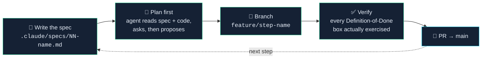
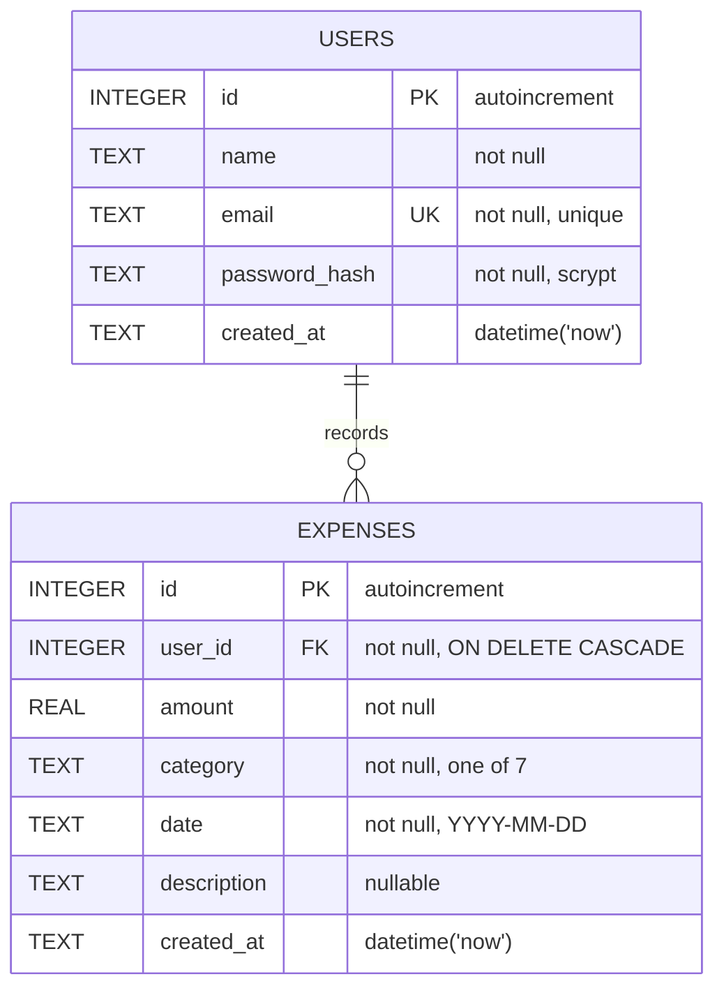

<div align="center">


<br>


**A personal expense tracker built with Flask and SQLite — and an excuse to learn Claude Code properly.**

</div>

---

## 🎯 Why this project exists

> I'm building Spendly to **learn [Claude Code](https://claude.com/claude-code)**.
>
> The expense tracker is the vehicle. The actual goal is getting fluent with the tool — writing
> specs an agent can execute, planning before coding, *reviewing* what the agent produces instead
> of accepting it, and keeping the whole thing in a git workflow that doesn't fall apart.
>
> So the interesting part of this repo isn't the app. It's **`.claude/specs/`** and the commit
> history: every feature starts as a written spec, becomes an approved plan, gets implemented on
> its own branch, and lands through a pull request.

<div align="center">

</div>

---

## 🔁 The loop I'm practising

<div align="center">

</div>



<details>
<summary><b>💥 The mistake that taught me the loop matters — click to read</b></summary>

<br>

On Step 1 I let the agent write `database/db.py` **before** reading the spec. It produced a
perfectly reasonable data layer:

- a normalised `categories` table with a foreign key
- a category list of its own invention
- a `spent_on` date column
- its own choice of demo user

Every one of those contradicted the spec, which wanted a flat `category TEXT` column, a fixed
7-value list, a `date` column, and a specific demo account. All of it had to be thrown out and
rewritten.

**Lesson: spec first, then plan, then code.** A fast wrong answer costs more than a slow right
one. This is the habit the project is really teaching, and it's why plan mode now comes before
every step.

</details>

---

## ⚡ Quick start

<details open>
<summary><b>Setup — three commands</b></summary>

<br>

```bash
git clone https://github.com/Mohit-Kumar-Thakur/Spendly.git
cd Spendly

python -m venv venv
source venv/bin/activate        # Windows: venv\Scripts\activate

pip install -r requirements.txt
python app.py
```

Open **http://127.0.0.1:5001** 🎉

The database is created and seeded automatically on startup — no migration step, no setup script.

</details>

<details>
<summary><b>🔑 Demo account</b></summary>

<br>

| | |
| --- | --- |
| **Email** | `demo@spendly.com` |
| **Password** | `demo123` |

Seeded with 8 sample expenses covering every category. Login itself arrives in Step 2 — until
then the account just sits in the database waiting.

</details>

<details>
<summary><b>🔄 Rebuilding the database from scratch</b></summary>

<br>

```bash
rm expense_tracker.db
python -m database.db
```

`init_db()` uses `CREATE TABLE IF NOT EXISTS` and `seed_db()` bails out early if any user exists,
so both are safe to run as many times as you like — you cannot duplicate the seed data.

</details>

---

## 🗄️ The data model



<details>
<summary><b>📋 Full column reference</b></summary>

<br>

**`users`**

| Column | Type | Constraints |
| --- | --- | --- |
| `id` | INTEGER | Primary key, autoincrement |
| `name` | TEXT | Not null |
| `email` | TEXT | Not null, **unique** |
| `password_hash` | TEXT | Not null |
| `created_at` | TEXT | Defaults to `datetime('now')` |

**`expenses`**

| Column | Type | Constraints |
| --- | --- | --- |
| `id` | INTEGER | Primary key, autoincrement |
| `user_id` | INTEGER | Not null, FK → `users.id`, `ON DELETE CASCADE` |
| `amount` | REAL | Not null |
| `category` | TEXT | Not null |
| `date` | TEXT | Not null, `YYYY-MM-DD` |
| `description` | TEXT | Nullable |
| `created_at` | TEXT | Defaults to `datetime('now')` |

</details>

<details>
<summary><b>🏷️ The seven categories</b></summary>

<br>

Fixed list, defined once as `CATEGORIES` in `database/db.py`:

`Food` · `Transport` · `Bills` · `Health` · `Entertainment` · `Shopping` · `Other`

They live in Python rather than a database table on purpose — the spec called for a flat
`category TEXT` column, and a lookup table would be over-engineering for seven values that
never change.

</details>

<details>
<summary><b>🔒 Rules the data layer sticks to</b></summary>

<br>

- **Parameterized queries only.** Never string formatting in SQL — not once, anywhere.
- **`PRAGMA foreign_keys = ON` on every connection.** SQLite has FK enforcement *off* by
  default, so without this a bad `user_id` inserts silently instead of failing.
- **`row_factory = sqlite3.Row`**, so rows are read by column name, not index.
- **`seed_db()` is idempotent** — returns early if any user exists.
- **Passwords hashed with `generate_password_hash`**, never stored in plain text.
- **No ORM.** Raw `sqlite3` so nothing hides what the queries are actually doing.

</details>

---

## 🛠️ Tech stack

<div align="center">

| Layer | Choice | Why |
| :--- | :--- | :--- |
| **Backend** | Flask 3.1 | Small enough to hold in your head |
| **Database** | SQLite via `sqlite3` | Standard library, zero setup, real SQL |
| **Templating** | Jinja2 | Comes with Flask |
| **Frontend** | Plain HTML + CSS + vanilla JS | No build step, nothing hidden |
| **Passwords** | `werkzeug.security` | Already a Flask dependency |
| **Tests** | pytest + pytest-flask | — |
| **Prod server** | gunicorn | `flask run` is a development server and says so |
| **Hosting** | Railway | Reads the `Procfile`, no config file needed |

</div>

No SQLAlchemy. No frontend framework. No bundler. Everything hand-written so there's nothing
between me and what's actually happening.

---

## 📁 Project structure

```
Spendly/
├── app.py                      # Flask app, routes, startup DB init
├── database/
│   ├── __init__.py
│   └── db.py                   # get_db() · init_db() · seed_db() · CATEGORIES
├── templates/                  # base · landing · login · register · terms · privacy
├── static/
│   ├── css/                    # style.css · landing.css
│   └── js/main.js
├── .claude/
│   └── specs/                  # 📌 one spec per step — the source of truth
├── .github/assets/             # the animated art in this README
├── Procfile                    # gunicorn entry point for deployment
├── requirements.txt
└── expense_tracker.db          # created on first run (gitignored)
```

---

## 🚀 Deployment

> **Status — configured, deliberately not deployed. There is no public URL.**
>
> The app is deployment-ready and boots correctly under gunicorn. It was not shipped because
> Railway's free trial has ended and hosting it now requires a paid plan — not worth it for a
> practice project whose goal was the build loop, not running a service. Everything needed to
> deploy is in the repo, so `railway up` is the only remaining step if that ever changes.

<details open>
<summary><b>What makes it deployable</b></summary>

<br>

| Piece | Why it's needed |
| :--- | :--- |
| `Procfile` | `web: gunicorn app:app --bind 0.0.0.0:$PORT` — without it the platform runs `python app.py`, which binds port 5001 on localhost with `debug=True` and is unreachable from outside |
| `gunicorn` in `requirements.txt` | The production WSGI server that actually serves the app |
| `SECRET_KEY` env var | **Required.** See below |
| `DB_PATH` env var | Optional override for the SQLite file location |

</details>

<details>
<summary><b>🔐 SECRET_KEY is mandatory in a deployment</b></summary>

<br>

Session cookies are signed with `app.secret_key`. The development fallback is written down in
`app.py`, so anything using it would let a stranger forge a cookie and sign in as any user.

A deployed environment that doesn't set `SECRET_KEY` therefore refuses to start:

```
RuntimeError: SECRET_KEY must be set in the environment when deployed.
```

Local runs and the test suite keep the fallback, so nothing changes day to day. Generate a real
one with:

```bash
python -c "import secrets; print(secrets.token_hex(32))"
```

</details>

<details>
<summary><b>⚠️ The database resets on every redeploy</b></summary>

<br>

The container filesystem is ephemeral and `expense_tracker.db` is gitignored, so each deploy
starts from `seed_db()` alone — every account and expense created on the live site is gone.

This is a deliberate trade-off. Spendly is a practice project, and the point is the build loop,
not running a service anyone depends on. Making data survive would mean a mounted volume or a
move to Postgres; neither is worth it here.

</details>

---

## 🗺️ Roadmap

<div align="center">

| Step | Feature | Status |
| :---: | :--- | :---: |
| **1** | Database setup — schema, connection helper, seed data | ✅ **Done** |
| **2** | Registration | ✅ **Done** |
| **3** | Login / logout | ✅ **Done** |
| **4** | Profile page | ✅ **Done** |
| **5** | Backend connection — the profile page reads real data | ✅ **Done** |
| **6** | Date filter — narrow the profile page to a date range | ✅ **Done** |
| **7** | Add expense | ✅ **Done** |
| **8** | Edit expense | ✅ **Done** |
| **9** | Delete expense | ✅ **Done** |

</div>

All nine steps are in. The placeholder routes that stood in `app.py` from commit one — so the
shape of the finished app was visible before any of it worked — are now the real thing.

**This project is complete.** Nine specs, nine plans, nine branches, nine pull requests, and 202
passing tests. The loop at the top of this README is the thing I was actually here to learn, and
it held all the way through. Spendly runs locally; it was never meant to run anywhere else.

<details>
<summary><b>✅ Step 1 — what "done" actually meant</b></summary>

<br>

Every box below was exercised, not assumed:

- [x] Database file is created on app startup
- [x] Both tables exist with the exact columns and constraints from the spec
- [x] Demo user exists with a scrypt-hashed password (verified it isn't plain text)
- [x] 8 sample expenses spanning all 7 categories
- [x] Seeded three times in a row — counts stayed at 1 user / 8 expenses
- [x] Duplicate email raises `IntegrityError` (UNIQUE)
- [x] `user_id = 999` raises `IntegrityError` (foreign keys genuinely enforced)
- [x] Deleted the DB, ran `python app.py` — booted clean, rebuilt, landing page returned 200

</details>

<details>
<summary><b>✅ Step 2 — what "done" actually meant</b></summary>

<br>

The form existed since commit one but `POST /register` returned 405. Now it doesn't — and every
box below was exercised, not assumed:

- [x] `POST /register` returns `302` to `/login?registered=1` — POST/redirect/GET, so a refresh
      can't double-submit
- [x] Password stored as a `scrypt:` hash — grepped the row, the plaintext isn't in it
- [x] `Test@Example.com` and `TEST@example.com` are the same account — email lowercased on write
      and on the duplicate check
- [x] Duplicate email re-renders with "An account with that email already exists." and creates no
      second row
- [x] A 7-character password sent by `curl`, bypassing the browser's `minlength`, still returns
      200 and no row — the server check is the real one
- [x] Whitespace-only name and an email with no `@` each return their own error
- [x] After a failure the name and email fields are still filled, the password field is empty
- [x] The Step 1 demo account and all 8 seeded expenses are untouched
- [x] 14 pytest cases green (`python -m pytest tests/ -v`) — the repo's first test suite
- [x] No string interpolation anywhere near the SQL; `.auth-success` uses only CSS variables

Deliberately **not** in this step: sessions, `SECRET_KEY`, and any logged-in state. Those are
Step 3, and registration ends at the login page on purpose.

</details>

<details>
<summary><b>✅ Step 3 — what "done" actually meant</b></summary>

<br>

The hinge of the roadmap: the app can finally answer "who is asking?". Every box below was
exercised, not assumed:

- [x] `POST /login` with the demo credentials returns `302` to `/profile` with a
      `Set-Cookie: session=...; HttpOnly`
- [x] `DEMO@Spendly.com` signs in — casing normalised the same way Step 2 stored it
- [x] A wrong password and an unregistered email return responses that are **identical** once the
      echoed address is normalised out — diffed them, so neither can be used to enumerate accounts
- [x] `/profile` and all three `/expenses/*` placeholders return `302` to `/login` logged out and
      `200` logged in
- [x] The navbar flips: "Sign in / Get started" becomes "Demo / Sign out", and back again
- [x] `/logout` returns `302` to `/`, and `/profile` is blocked immediately after
- [x] Visiting `/login` while already signed in redirects to `/profile` instead of re-showing the form
- [x] Deleting the logged-in user out from under a live session redirects instead of raising
- [x] Passwords verified with `check_password_hash` only — grepped for `== password`, nothing
- [x] Step 2 still works end to end: registered a fresh account, followed the redirect, signed in
- [x] 33 pytest cases green (`python -m pytest tests/ -v`) — Step 2's 14 plus 19 new

Deliberately **not** in this step: password change, "remember me", password reset, and rate
limiting. `SECRET_KEY` reads from the environment with an obviously-fake development fallback.

</details>

<details>
<summary><b>✅ Step 4 — what "done" actually meant</b></summary>

<br>

A design step, not a data step. `/profile` had been a one-line stub since Step 3; it is now the
finished layout, driven entirely by hardcoded values so the UI could be settled before any
querying exists. Every box below was exercised, not assumed:

- [x] `/profile` returns `302` to `/login` logged out and `200` logged in — the Step 3
      `@login_required` decorator is the guard, not a second inline session check
- [x] The user card reads **name, email and avatar initials from the real session user**, so a
      freshly registered account sees its own name rather than "Demo User". Only the money is
      hardcoded
- [x] `avatar_initials()` survives a one-word name, a three-word name and an empty string —
      the case that would have crashed had it been done with indexing in Jinja
- [x] The three summary stats reconcile with the table beneath them: the eight rows sum to
      exactly ₹337.54, and the breakdown's per-category totals sum back to the same figure.
      Tested by recomputing from `PROFILE_EXPENSES`, not by copying the constants
- [x] All 8 transactions render, all 7 categories appear in the breakdown, each with its own
      badge colour
- [x] The hardcoded rows mirror `SAMPLE_EXPENSES` exactly, so Step 5's swap to real queries
      should be visually a no-op — that's the point of building it this way
- [x] **No hex colour and no `style=` anywhere in `profile.html`** — asserted against the
      template source, since `base.html` and ordinary hrefs legitimately contain `#`. Seven new
      `--cat-*` token pairs carry the badge colours
- [x] Bar widths come from a `.bar-w-*` class ladder rather than an inline width. The one
      genuinely awkward part of the step, and the only way to honour the no-inline-styles rule
      while keeping the widths data-driven for Step 5
- [x] Checked at a 485px viewport: `scrollWidth == clientWidth`, so nothing overflows —
      the stat row collapses to one column and the table scrolls inside its own wrapper
- [x] 48 pytest cases green (`python -m pytest tests/ -v`) — Step 3's 33 plus 15 new

Deliberately **not** in this step: any database query. The profile reads no expenses — that is
Step 5, and wiring it early would have hidden whether the layout actually held up on its own.

</details>

<details>
<summary><b>✅ Step 7 — what "done" actually meant</b></summary>

<br>

The step where the app stops being read-only. Every box below was exercised, not assumed:

- [x] `/expenses/add` renders a real form; the Step 3 placeholder string is gone
- [x] The category selector is generated by looping `CATEGORIES`, so it shows exactly the seven
      values the database knows and cannot drift from them
- [x] The date field opens pre-filled with today — the only default certain to pass validation
- [x] A valid submit redirects to `/profile`, where the new row shows up in the table, the
      summary total and the breakdown at once
- [x] **The owner comes from the session, never from the form** — posting a `user_id` naming
      another account files the expense against the logged-in user anyway, asserted by checking
      the other account still has zero
- [x] Blank, `abc`, `0`, `-5` and `99999999` are each refused with one message, and the row count
      stays at 8 — "nothing was written" asserted as a count, not as the absence of a traceback
- [x] `float("inf")` parses and passes a naive `> 0` check; one `SUM` over it turns every number
      on the profile page into `inf`. Explicitly rejected
- [x] A future date is refused, because every Step 6 preset ends at today and a future expense
      would be invisible under all of them
- [x] Nothing typed is lost to a validation failure — the rejected form comes back filled in
- [x] POST/redirect/GET, so a refresh does not file the same expense twice
- [x] A blank description stores `NULL`, not `""`, so the table shows an empty cell rather than
      something that looks like a bug
- [x] 148 pytest cases green (`python -m pytest tests/ -v`) — Step 6's 109 plus 39 new

One thing the tests found that the feature did not: pytest-flask pushes a single request context
for a whole test, and Flask reuses an existing application context rather than making a new one —
so every request a test made shared one `g`, and `current_user()` caches the resolved user there.
Two clients in one test could see each other's user. `conftest.py` now overrides that fixture, so
contexts are per-request in the tests exactly as they are in a real process.

Deliberately **not** in this step: CSRF tokens, and returning to whichever date filter was active
before clicking "Add expense".

</details>

<details>
<summary><b>✅ Step 8 — what "done" actually meant</b></summary>

<br>

Mostly not about the form — the form was already written. It is about an id in a URL being a
number anyone can change. Every box below was exercised, not assumed:

- [x] Every transaction row has an Edit action, and the links point at the ids actually rendered
- [x] The form opens pre-filled, showing `12.50` rather than `12.5`, matching the table
- [x] Saving a change returns to `/profile` with the new values in the table, the total moved by
      exactly the difference, and the count still 8 — an edit is not an insert
- [x] **Ownership is a `WHERE` clause, not an `if`** — `get_expense` and `update_expense` both
      carry `AND user_id = ?`, so the enforcement is in the statement rather than in a view that
      a third caller could forget to guard
- [x] A second account gets `404` on `GET` and on `POST`, and the row is **byte-identical
      afterwards** — asserting the 404 alone would also pass for a route that wrote the row and
      then fell over
- [x] An unknown id and someone else's id give the same `404`; a `403` would confirm the row
      exists, which is a way of counting other people's records
- [x] `update_expense` reports whether it changed anything, and the view turns nothing into a
      `404` — a row deleted between opening the form and saving it cannot produce a confirmation
      banner for a write that did not happen
- [x] `created_at` is unchanged by an edit — a correction is not a new record
- [x] Validation is Step 7's, reused unchanged, so an edit cannot store what an add would refuse
- [x] A rejected edit comes back showing the **unsaved edit**, not the stored row
- [x] Saving without changing anything is a success, not an error
- [x] 181 pytest cases green (`python -m pytest tests/ -v`) — Step 7's 148 plus 33 new

</details>

<details>
<summary><b>✅ Step 9 — what "done" actually meant</b></summary>

<br>

The last step, and the only irreversible one. Every box below was exercised, not assumed:

- [x] Delete sits beside Edit on every row, muted until hovered — a red link in all eight rows
      would be the loudest thing in a table about money
- [x] It opens a confirmation page naming the exact expense — amount, category, date and
      description, read fresh from the database rather than passed through the query string
- [x] **Opening that page deletes nothing**, asserted by count
- [x] **The deletion is `POST`-only.** A link that deleted would be followed by prefetchers and
      crawlers, and the confirmation page above it would be decoration. Keeping `GET` as a real
      page is also what lets the table action stay a plain link with no JavaScript
- [x] Confirming removes exactly one row — the **remaining ids are checked by value**, because a
      `DELETE` with a broken `WHERE` passes a count-only test whenever the arithmetic works out
- [x] Ownership is re-checked at the point of the write, not trusted from the page that led
      there — so a double submit is a `404`, not a second cheerful banner
- [x] A second account gets `404` on both methods and all 8 rows survive; another user's expenses
      are asserted untouched, not assumed
- [x] Deleting the ₹120.00 shopping expense moves the total, the count **and** the top category —
      an end-to-end signal that all three sections read the same data
- [x] Deleting every expense lands on the first-run empty state rather than dividing by zero in
      the breakdown
- [x] 202 pytest cases green (`python -m pytest tests/ -v`) — Step 8's 181 plus 21 new

Deliberately **not** in this step: a soft-delete column. It would mean every read in
`database/queries.py` growing a filter it does not have, and the confirmation page is the
safeguard this project's scope calls for.

</details>

---

## ⚠️ Scope

This is a **learning project**, not production software. The dev server runs in debug mode,
there's no CSRF protection or rate limiting, and the demo credentials are committed on purpose.
Please don't deploy it anywhere that matters.

It is also **finished**. There is no live instance and no further steps planned — clone it and
run it locally if you want to look around. What's worth reading is `.claude/specs/` and the
commit history, not the app.

<div align="center">

<br>

**Built step by step with [Claude Code](https://claude.com/claude-code)** 🤖

<sub>Every commit here is also a note-to-self about how to work with an agent.</sub>

</div>
